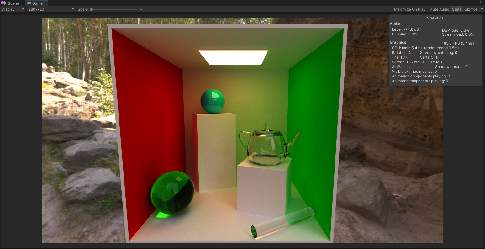
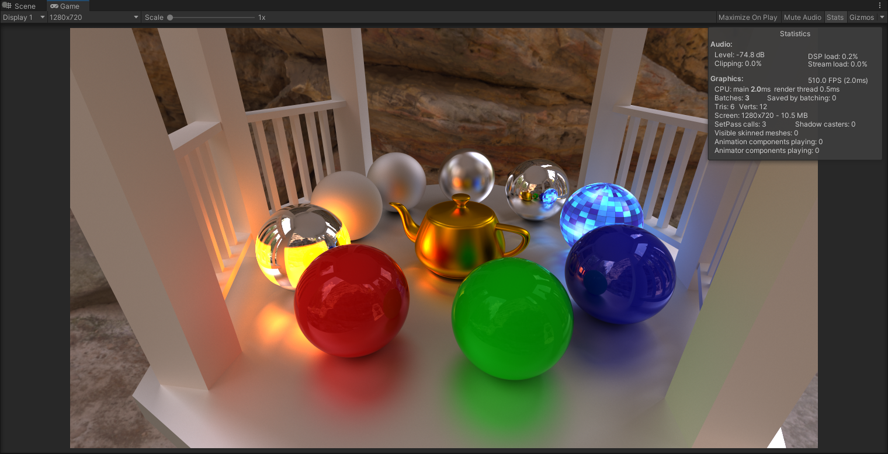
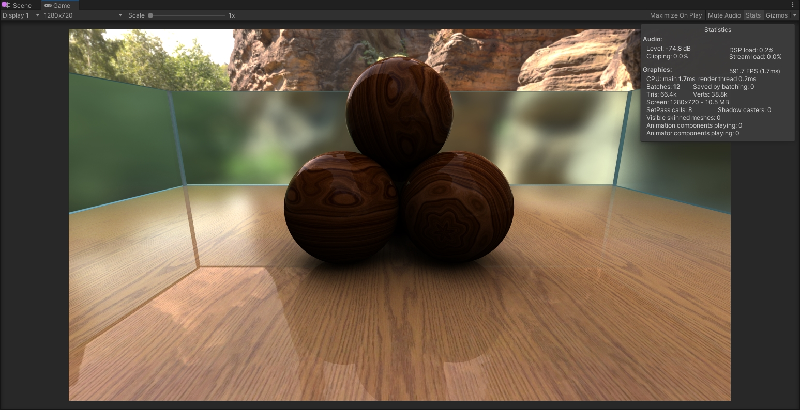
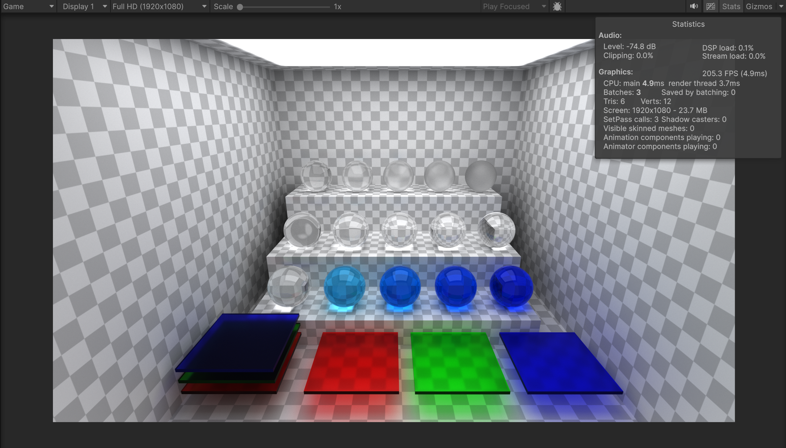
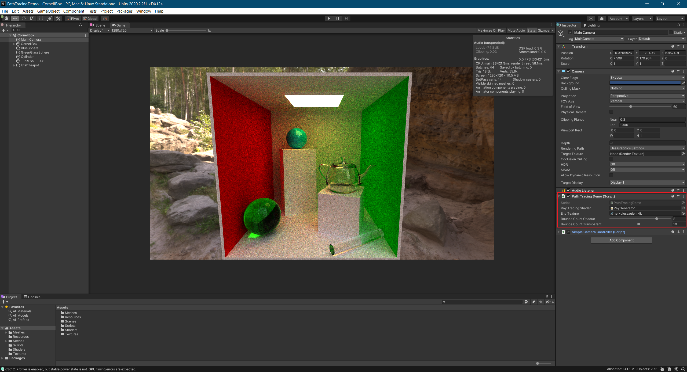

# Path Tracing Demo

This demo implements a Monte Carlo Path Tracing technique using hardware accelerated ray tracing support in Unity. There is no rasterization based rendering in the demo and a render pipeline is not used (the Camera doesn't render any geometry).

## Prerequisites

* Windows 10 version 1809 and above.
* Any NVIDIA GPU starting from GTX 1060 with 6 GB of VRAM. AMD 6000 series GPUs based on RDNA 2 and above will also run the demo.
* Unity 6.0 and above.

## Recommendations

* Use **winver** in a command prompt to see exactly which Windows version you are using.
* NVIDIA RTX 2000 or AMD Radeon 6000 series GPUs and above are recommended because they have hardware units dedicated for ray tracing. A GTX 1060 GPU was 10 to 15 times slower in tests because ray tracing support is emulated and runs entirely on compute units.
* Alternatively use a tool like GPU-Z to check if your system supports ray tracing. The demo will print an error in the console window if ray tracing is not supported.

## Setup and Interaction

When in Play Mode, hold right mouse button down and use WASD keys to navigate through the scene. Convergence is reset when the view changes.

## Direct lighting

Analytic lights placed in the scene are sampled with next event estimation (NEE): at every opaque surface hit one light is picked uniformly at random, the BRDF is evaluated in its direction, and a single shadow ray tests visibility. The contribution `BRDF · cos(θ) · L_e · visibility / pickPdf` is added to the path radiance. This converges much faster than relying on the environment cubemap miss alone, especially for small or concentrated light sources.

The shadow ray is fired directly from the closest hit shader and the NEE contribution is folded into `payload.emission`. The ray gen integrator picks it up as part of the standard `radiance += emission * throughput` accumulation, then dispatches the BSDF sampled continuation ray on the next iteration. This requires `max_recursion_depth = 2` (primary ray plus one shadow ray); the shadow ray uses `RAY_FLAG_SKIP_CLOSEST_HIT_SHADER` so a geometry hit cannot recurse back into a closest hit shader and stay within that bound.

Supported types:

* **Directional** — Unity `Light` components with `Type = Directional`. Color is `light.color.linear * light.intensity`. The light is treated as a finite extent sun disc sampled with a uniform cone (full angular diameter `K_DIRECTIONAL_ANGULAR_DIAMETER`, hardcoded in `Lights.hlsl` to 0.5°), which produces soft penumbra shadows. Set the constant to 0 for a pure delta light with hard shadows.
* **Point** — Unity `Light` components with `Type = Point`. Color is `light.color.linear * light.intensity`, treated as luminous intensity. Range attenuation uses the smooth windowed inverse square from Lagarde 2014: `attenuation = (min(1/d, 1/threshold) · saturate(1 − (d²/range²)²))²`. The 1 cm clamp avoids the singularity right next to the bulb; the squared window smoothly fades to zero at `light.range`. Treated as a delta point, so shadows are sharp.

Shadow rays use `RAY_FLAG_ACCEPT_FIRST_HIT_AND_END_SEARCH | RAY_FLAG_SKIP_CLOSEST_HIT_SHADER`, so glass casts opaque shadows. The `PathTracing/StandardGlass` material does not perform NEE: for a delta light through a delta-ish transmissive surface the contribution is effectively zero.

## References

The GGX-Smith specular implementation and supporting utilities draw on the following publications:

* Trowbridge, T. S., & Reitz, K. P. (1975). *Average irregularity representation of a rough surface for ray reflection*. JOSA 65(5). — Original GGX normal distribution.
* Schlick, C. (1994). *An Inexpensive BRDF Model for Physically-Based Rendering*. Computer Graphics Forum 13(3). — Fresnel approximation.
* Walter, B., Marschner, S. R., Li, H., & Torrance, K. E. (2007). *Microfacet Models for Refraction through Rough Surfaces*. EGSR 2007. — GGX in a rendering context; rough-refraction BTDF.
* Burley, B. (2012). *Physically-Based Shading at Disney*. SIGGRAPH 2012 Course: Practical Physically Based Shading in Film and Game Production. — Perceptual smoothness → α = (1 − s)² convention.
* Frisvad, J. R. (2012). *Building an Orthonormal Basis from a 3D Unit Vector Without Normalization*. Journal of Graphics Tools 16(3).
* Heitz, E. (2014). *Understanding the Masking-Shadowing Function in Microfacet-Based BRDFs*. Journal of Computer Graphics Techniques 3(2). — Smith G1 and height-correlated G2.
* Heitz, E., & d'Eon, E. (2014). *Importance Sampling Microfacet-Based BSDFs using the Distribution of Visible Normals*. EGSR 2014.
* Duff, T., Burgess, J., Christensen, P., Hery, C., Kensler, A., Liani, M., & Villemin, R. (2017). *Building an Orthonormal Basis, Revisited*. Journal of Computer Graphics Techniques 6(1). — Branchless tangent-space basis.
* Heitz, E. (2018). *Sampling the GGX Distribution of Visible Normals*. Journal of Computer Graphics Techniques 7(4). — VNDF importance sampling.
* ITU-R Recommendation BT.709. *Parameter values for the HDTV standards for production and international programme exchange*. — Rec. 709 luminance weights.
* Ertl, O. (2010). *Numerical Methods for Topography Simulation*. PhD thesis, TU Wien, §5.3.4, eq. (5.53). https://www.iue.tuwien.ac.at/phd/ertl/node100.html — `normalize(N + random_unit_vector)` cosine-weighted hemisphere sampling.
* Veach, E. (1997). *Robust Monte Carlo Methods for Light Transport Simulation*. PhD thesis, Stanford University. — Next event estimation foundations.
* Lagarde, S., & de Rousiers, C. (2014). *Moving Frostbite to Physically Based Rendering 3.0*. SIGGRAPH 2014 Course: Physically Based Shading in Theory and Practice. — Smooth windowed inverse square attenuation for punctual lights.
