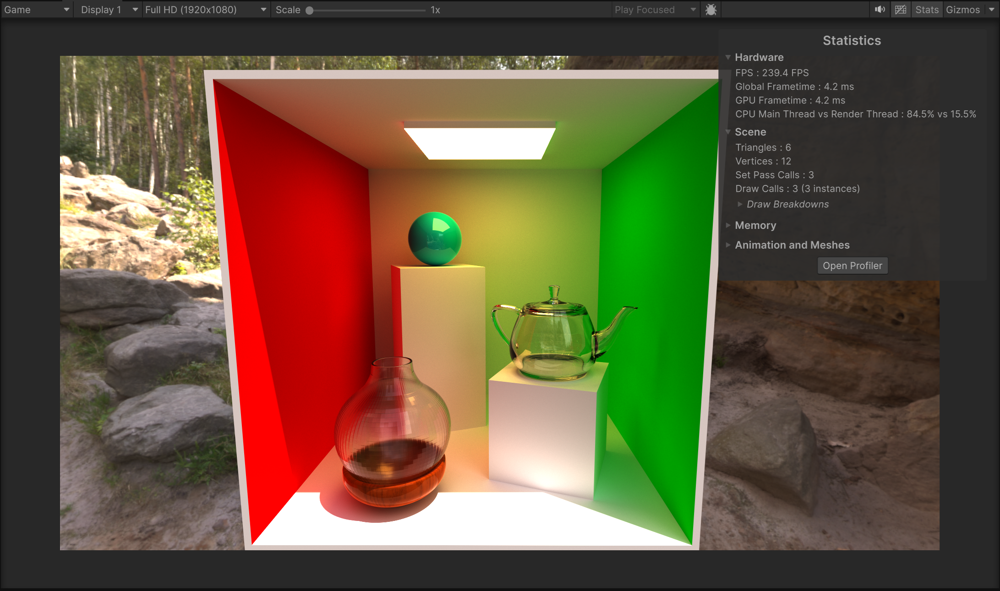
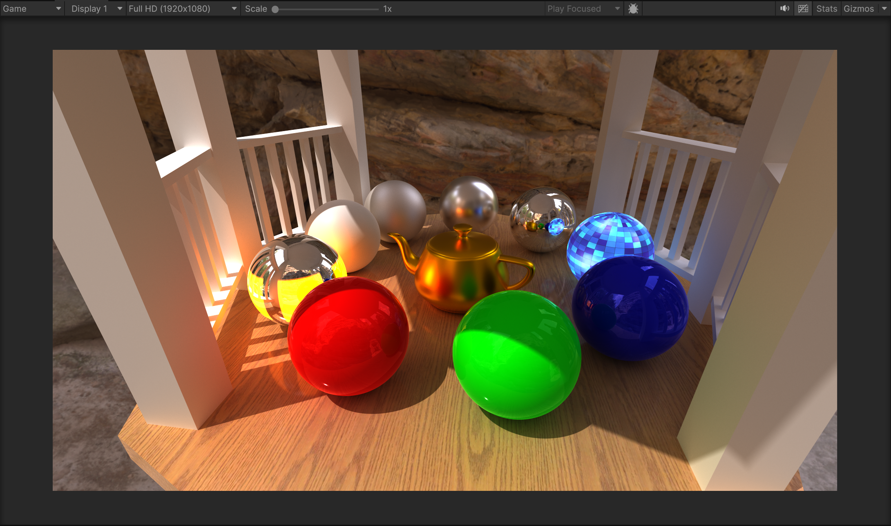
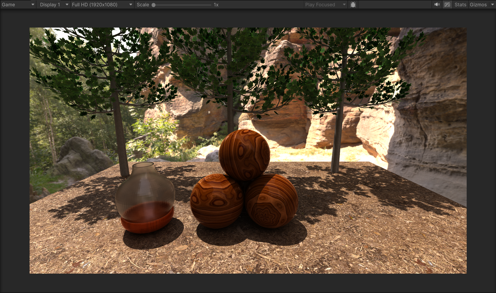
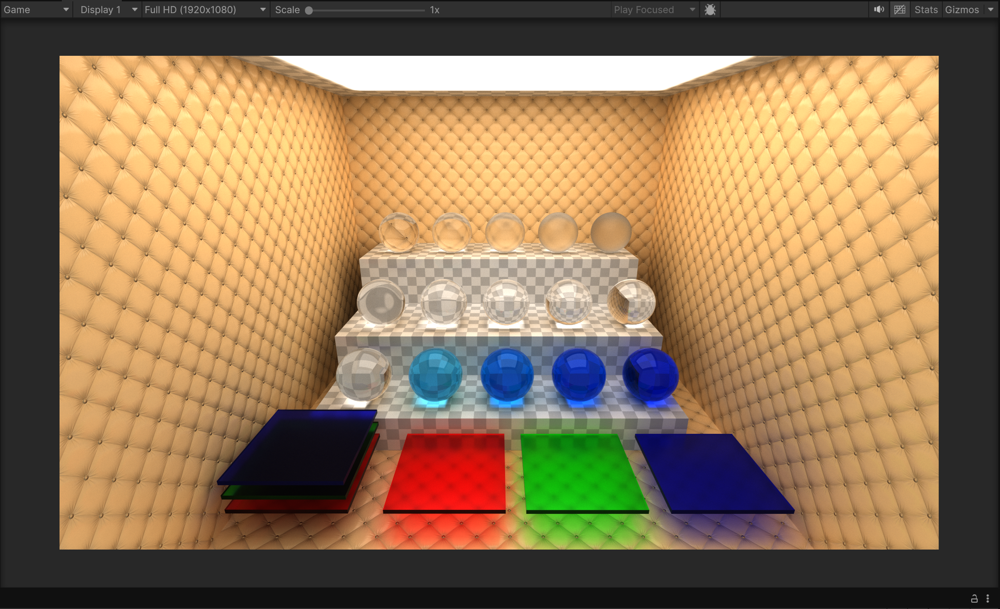
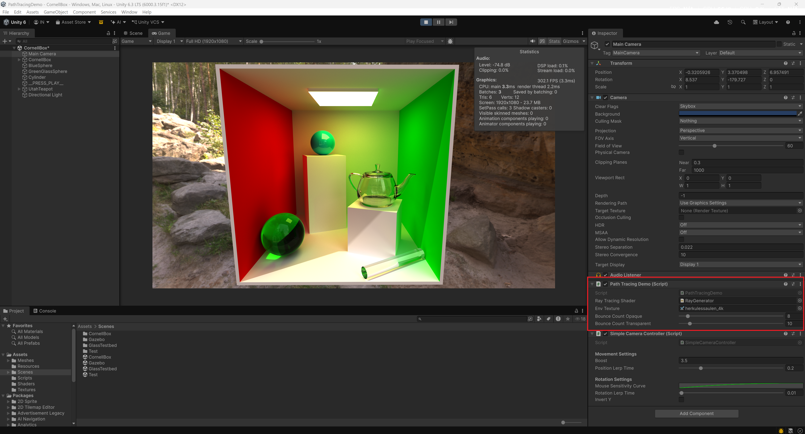
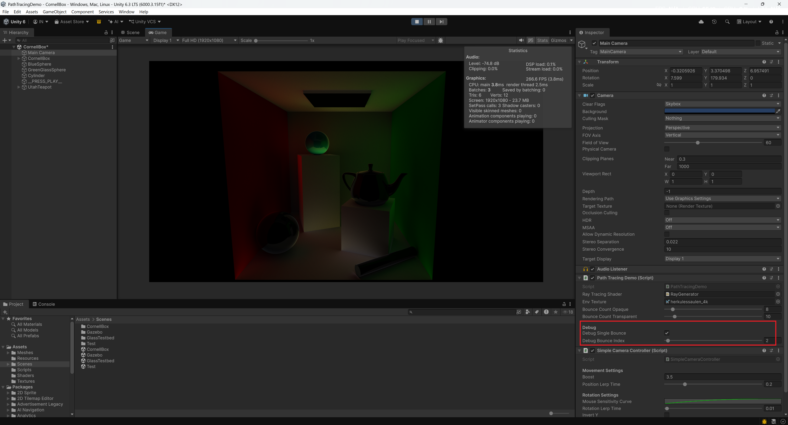

# Path Tracing Demo

This demo implements a unidirectional Monte Carlo path tracing technique using hardware accelerated ray tracing support in Unity. There is no rasterization based rendering in the demo and a render pipeline is not used (the Camera doesn't render any geometry).

## Prerequisites

* Windows 10 version 1809 and above.
* Any NVIDIA GPU starting from GTX 1060 with 6 GB of VRAM. AMD 6000 series GPUs based on RDNA 2 and above will also run the demo.
* Unity 6.3 and above.

## Recommendations

* Use **winver** in a command prompt to see exactly which Windows version you are using.
* NVIDIA RTX 2000 or AMD Radeon 6000 series GPUs and above are recommended because they have hardware units dedicated to ray tracing. A GTX 1060 GPU was 10 to 15 times slower in tests because ray tracing support is emulated and runs entirely on compute units.
* Alternatively use a tool like GPU-Z to check if your system supports ray tracing. The demo will print an error in the console window if ray tracing is not supported.

## Setup and Interaction

When in Play Mode, hold right mouse button down and use WASD keys to navigate through the scene.

The image is built by progressively averaging samples across frames, so it converges only while the scene and view hold still. Anything that would change the result discards the accumulated radiance and restarts the average from the first sample. Convergence resets when:

* any material property is edited — this includes only materials used by Renderers in the acceleration structure;
* an object is added, removed, or moved;
* a light is added, removed, or changed (color, type, direction, range, or position);
* the camera moves or rotates;
* Space is pressed (manual reset);
* the opaque or transparent bounce count changes;
* **Debug Single Bounce** is toggled, or **Debug Bounce Index** changes while it is enabled;
* the render target is resized (the window or camera resolution changes).

Enable **Debug Single Bounce** in the inspector to isolate the radiance gathered at a single bounce; **Debug Bounce Index** selects which one, where 0 is the primary ray hit. Every other bounce contributes black, which is useful for inspecting how each bounce builds up the final image.

## Materials

Only materials derived from `PathTracingStandard.shader` and `PathTracingStandardGlass.shader` are supported by the path tracer. These are the only shaders that provide a `RayTracing` pass.

`PathTracingStandard.shader` exposes a **Surface Type** setting in the material inspector:

* **Opaque** — every triangle is a solid occluder. The acceleration structure marks these submeshes closest hit only, so no any hit shader runs and traversal is at its fastest.
* **Cutout** — the albedo texture alpha is compared against the **Alpha Cutoff** threshold per pixel. Texels below the cutoff are skipped, leaving a hard edged hole; texels at or above it shade as opaque. This drives the `ALPHATEST_ON` keyword, which enables an any hit shader that samples the albedo alpha and calls `IgnoreHit()` below the cutoff. The cutout applies to camera rays and shadow rays alike, so foliage and fences cast correctly perforated shadows.

A **Double Sided** toggle controls back-face culling. When off, the surface is single sided: rays that strike a back face pass straight through, matching `Cull Back` in the editor preview. When on, the toggle enables the `DOUBLE_SIDED_ON` keyword, which `RayTracingInstanceTriangleCullingConfig.optionalDoubleSidedShaderKeywords` registers as double sided, so the acceleration structure traces both faces and the closest hit shader flips the shading normal on back-face hits. Enable it for thin geometry such as leaves and cloth that needs to be lit from either side.

## Direct lighting

Unity lights placed in the scene are sampled with next event estimation (NEE): at every opaque surface hit one light is picked uniformly at random, the BRDF is evaluated in its direction, and a single shadow ray tests visibility.

Supported types:

* **Directional** — Unity `Light` components with `Type = Directional`, with color `light.color.linear * light.intensity`. It is sampled using a cone for soft penumbra shadows, or set the `K_DIRECTIONAL_ANGULAR_DIAMETER` define to 0 for a pure delta light with sharp shadows.
* **Point** — Unity `Light` components with `Type = Point`, with color `light.color.linear * light.intensity`.

## References

* Trowbridge, T. S., & Reitz, K. P. (1975). *Average irregularity representation of a rough surface for ray reflection*. JOSA 65(5). — Original GGX normal distribution.
* Schlick, C. (1994). *An Inexpensive BRDF Model for Physically-Based Rendering*. Computer Graphics Forum 13(3). — Fresnel approximation.
* Walter, B., Marschner, S. R., Li, H., & Torrance, K. E. (2007). *Microfacet Models for Refraction through Rough Surfaces*. EGSR 2007. — GGX in a rendering context; rough-refraction BTDF.
* Burley, B. (2012). *Physically-Based Shading at Disney*. SIGGRAPH 2012 Course: Practical Physically Based Shading in Film and Game Production. — Perceptual smoothness → α = (1 − s)² convention.
* Frisvad, J. R. (2012). *Building an Orthonormal Basis from a 3D Unit Vector Without Normalization*. Journal of Graphics Tools 16(3).
* Heitz, E. (2014). *Understanding the Masking-Shadowing Function in Microfacet-Based BRDFs*. Journal of Computer Graphics Techniques 3(2). — Smith G1 and height-correlated G2.
* Heitz, E., & d'Eon, E. (2014). *Importance Sampling Microfacet-Based BSDFs using the Distribution of Visible Normals*. EGSR 2014.
* Duff, T., Burgess, J., Christensen, P., Hery, C., Kensler, A., Liani, M., & Villemin, R. (2017). *Building an Orthonormal Basis, Revisited*. Journal of Computer Graphics Techniques 6(1). — Branchless tangent-space basis.
* Heitz, E. (2018). *Sampling the GGX Distribution of Visible Normals*. Journal of Computer Graphics Techniques 7(4). — VNDF importance sampling.
* van Antwerpen, D. G. (2023). *Solving Self-Intersection Artifacts in DirectX Raytracing*. NVIDIA Developer Blog. https://developer.nvidia.com/blog/solving-self-intersection-artifacts-in-directx-raytracing/ — Precise barycentric position interpolation and a deferred translation in the object to world transform for stable world space hit points.
* ITU-R Recommendation BT.709. *Parameter values for the HDTV standards for production and international programme exchange*. — Rec. 709 luminance weights.
* Ertl, O. (2010). *Numerical Methods for Topography Simulation*. PhD thesis, TU Wien, §5.3.4, eq. (5.53). https://www.iue.tuwien.ac.at/phd/ertl/node100.html — `normalize(N + random_unit_vector)` cosine-weighted hemisphere sampling.
* Veach, E. (1997). *Robust Monte Carlo Methods for Light Transport Simulation*. PhD thesis, Stanford University. — Next event estimation foundations.
* Lagarde, S., & de Rousiers, C. (2014). *Moving Frostbite to Physically Based Rendering 3.0*. SIGGRAPH 2014 Course: Physically Based Shading in Theory and Practice. — Smooth windowed inverse square attenuation for punctual lights.
