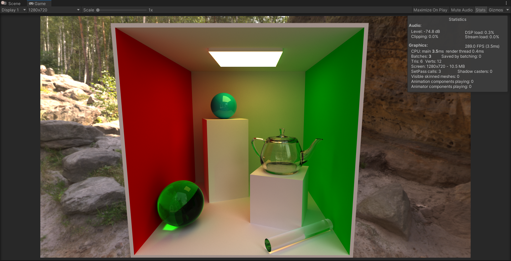
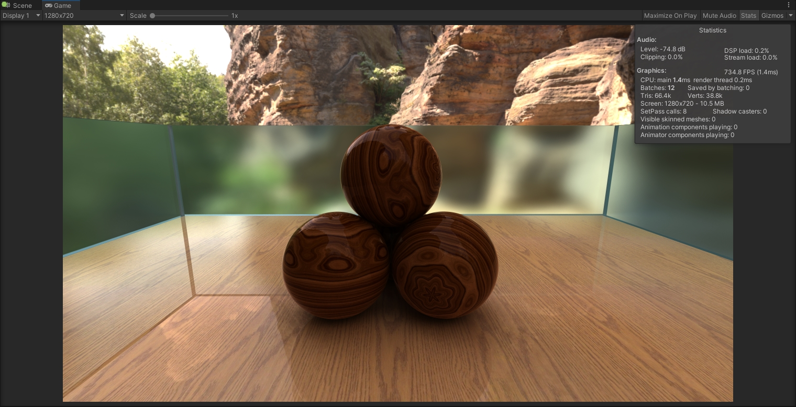
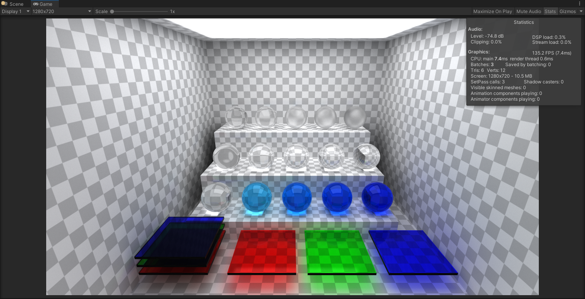

# Path Tracing Demo

This demo implements a Monte Carlo Path Tracing technique using hardware accelerated ray tracing support in Unity. There is no rasterization based rendering in the demo and a render pipeline is not used (the Camera doesn't render any geometry).

## Prerequisites

* Windows 10 version 1809 and above.
* Any NVIDIA GPU starting from GTX 1060 with 6 GB of VRAM. AMD 6000 series GPUs based on RDNA 2 and above will also run the demo.
* Unity 2020.2 and above.

## Recommendations

* Use **winver** in a command prompt to see exactly which Windows version you are using.
* NVIDIA RTX 2000 or AMD Radeon 6000 series GPUs and above are recommended because they have hardware units dedicated for ray tracing. A GTX 1060 GPU was 10 to 15 times slower in tests because ray tracing support is emulated and runs entirely on compute units.
* Alternatively use a tool like GPU-Z to check if your system supports ray tracing. The demo will print an error in the console window if ray tracing is not supported.

## Setup and Interaction

When in Play Mode, hold right mouse button down and use WASD keys to navigate through the scene. Convergence is reset when the view changes.

## Acknowledgements

Alan Wolfe (@Atrix256 on Twitter) for his blog about computer graphics. The demo was inspired by the series of 3 blog posts:

* https://blog.demofox.org/2020/05/25/casual-shadertoy-path-tracing-1-basic-camera-diffuse-emissive/
* https://blog.demofox.org/2020/06/06/casual-shadertoy-path-tracing-2-image-improvement-and-glossy-reflections/
* https://blog.demofox.org/2020/06/14/casual-shadertoy-path-tracing-3-fresnel-rough-refraction-absorption-orbit-camera/
